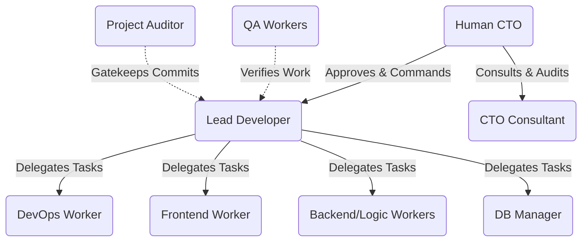
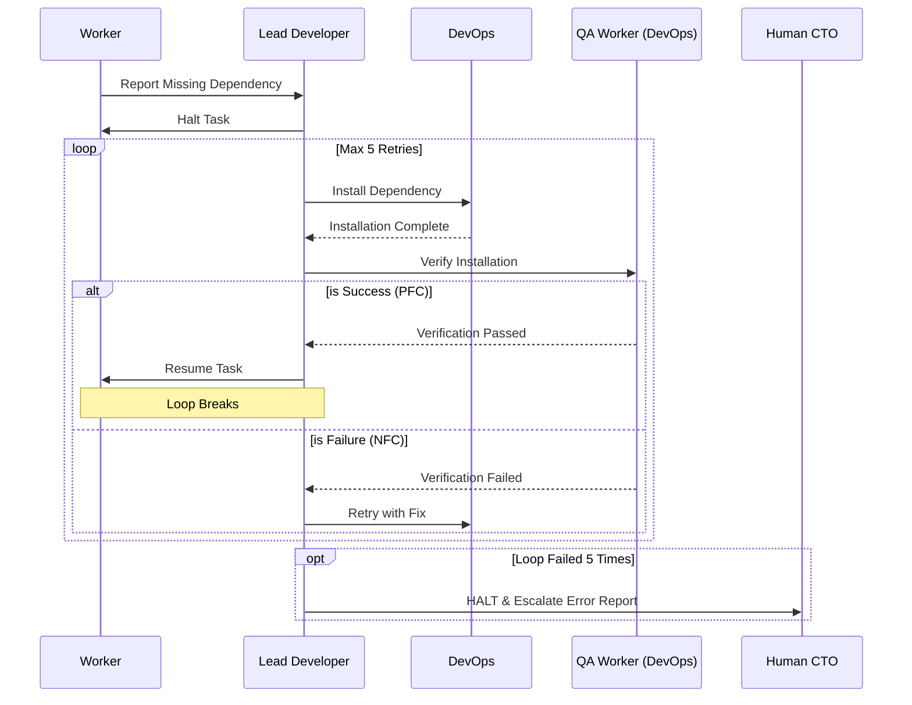
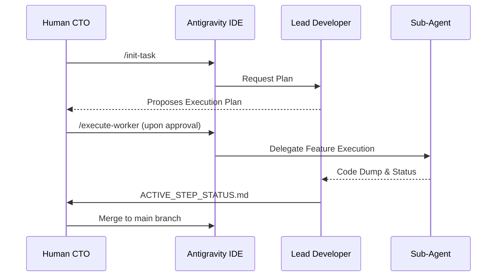

# Agentic Project Architecture: A Beginner's Guide

Welcome to the **Agentic Prompt Builder**! This isn't just a standard Next.js project. It is built using an "Agentic Workflow," meaning artificial intelligence (AI) agents write the code, while you (the Human CTO) make the architectural decisions and approve their work.

To make this work without the AI breaking things, we use a highly structured file system. This tutorial explains the two most important folders: `docs/` and `.agent/`.

---

## 🏗️ 1. The `docs/` Directory (The "What")

The `docs/` folder contains the long-term, human-written vision for the project. The AI agents read these files to understand _what_ they are supposed to build.

- **`docs/requirements/PRD.md` (Product Requirements Document):** The absolute source of truth. It defines the features, user personas, and non-functional requirements (like performance).
- **`docs/requirements/MVP_SPEC.md` (Minimum Viable Product):** A filtered version of the PRD. It lists the exact, step-by-step features we are building _right now_ to get a working version 1.0.
- **`docs/architecture/` (The Blueprint):** Contains the technical design (`SYSTEM_DESIGN.md`) and Architectural Decision Records (`decisions/000X-...md`). ADRs are strict rules (e.g., "We use Next.js Server Actions, NO REST APIs") that the AI must never violate.
- **`docs/design/UI_UX_SPEC.md`:** The visual translation layer. The CTO Consultant acts as the **UI/UX Liaison**, taking images/sketches from the Human CTO and translating them into machine-readable Tailwind/shadcn specifications for the Frontend Worker.

---

## 🧠 2. The `.agent/` Directory (The "How" & The "Mind")

If `docs/` is the blueprint, `.agent/` is the management system. This folder contains the memories, rules, and automated workflows that keep the AI agents in line.

### 📜 A. The Rulebook (`.agent/rules/`)

AI agents need strict boundaries, otherwise, they write inconsistent code.

- **`ORCHESTRATION_RULES.md` & `AGENT_COMMUNICATION.md`:** These define the "Chain of Command." The Human CTO is at the top. The "Lead Developer" manages the project but must ask for permission before modifying the file system. Agents are not allowed to prompt each other directly.

- **`TECH_STACK.md` & `GIT_CONVENTIONS.md`:** Enforces exactly which technologies the AI can use (Next.js, Tailwind, Prisma) and how it must save its work (using Git feature branches). Crucially, `TECH_STACK.md` contains the **Architectural Constraints** (e.g., Vercel timeouts, statelessness).
- **Worker Instructions (e.g., `FRONTEND_WORKER_INSTRUCTIONS.md`, `LOGIC_WORKER...`):** We don't use one giant AI for everything. The Lead Developer delegates tasks to specialized "Sub-Agents." These files are their job descriptions. For example, the Logic Worker is strictly forbidden from using React so it writes pure, fast backend code.
  - _Note on the Backend Worker:_ It is currently marked as **[SUSPENDED - ON VACATION]**. The Lead Developer must not delegate to it during the Next.js MVP phase to prevent architecture bloat.

### 💾 B. The Memory System (Root of `.agent/`)

Because AI chats eventually lose context, we force the AI to write its memories into the file system.

- **`ACTIVE_STEP_STATUS.md`:** The instantaneous "status report." Before the Lead Developer asks you for permission to proceed, it must write exactly what it just built and where the code is located into this file.
- **`CONSULTANT_ACTIVE_MEMORY.md`:** The private memory of the CTO Consultant (an auditing AI). It tracks where the project is and what risks to watch out for.
- **`PROJECT_AUDIT_LOG.md`:** The long-term, overarching architectural history. Useful for humans conducting compliance reviews after the project is done.
- **`LEAD_DEVELOPER_EXECUTION_LOG.md`:** The private diary of the Lead Developer. It logs every task it completed, the errors it made, and what it learned.

### ⚙️ C. The Automation (`.agent/workflows/`)

To save the Human CTO from typing massive instructions repeatedly, we use Antigravity IDE `/workflows`.

- **`init-task.md`:** When you type `/init-task` in the chat, the IDE automatically forces the Lead Developer to read the rules, look at the MVP spec, propose a plan for the next feature, and suggest a Git branch.
- **`execute-worker.md`:** When you type `/execute-worker`, the IDE automatically checks out the Git branch, injects the worker instructions into the AI, generates the code, updates the memory logs, and prepares a Git commit for your review.

### 🚀 3. Advanced System Integrity & Self-Healing

As the system scales, orchestrating multiple AI agents requires advanced cognitive mechanisms to prevent endless loops and "hallucination panics." The CTO Consultant (`/audit-system`) enforces the following advanced architecture rules globally:

#### A. Temporal Context Awareness (TCA)

When auditing the Lead Developer's logs, the Consultant must be aware of the "Chronological Fallacy".

- **The Concept:** If the physical code is currently broken (e.g., a file is empty) but the Lead Developer's historical diary (`LEAD_DEVELOPER_EXECUTION_LOG.md`) claims they successfully wrote it, the Lead Developer is **not hallucinating**.
- **The Reality:** They are merely "paused" in a past state where the file _did_ exist before being wiped by a later event. TCA ensures the system flags this as a `Pending Remediation` rather than a critical AI failure.

#### B. Total Flow Completeness (NFC & PFC)

Agentic pipelines (like QA checks) are essentially state machines.

- **Negative Flow Completeness (NFC):** Every decision or testing node MUST explicitly define the "Failure Branch." If a QA agent rejects code, the instructions MUST state what happens next (e.g., retry, escalate, or halt). Pipelines without failure paths are rejected as architecturally incomplete.
- **Positive Flow Completeness (PFC):** Similarly, when a QA check passes, the pipeline MUST explicitly state how the system resumes its main workflow.

#### C. Bounded-Retry Loops (The "5-Try" Rule)

We never allow infinite `while(failed)` loops between agents.

- **Example (Dependency Escalation):** If the Frontend Worker needs a missing package (`zustand`), the Lead Developer delegates installation to DevOps. The `QA DevOps Worker` then verifies the installation.
- If QA fails, the system loops back to DevOps. However, this is a **Bounded-Retry**. If the loop fails 5 times, the Lead Developer will automatically halt the entire process and escalate to the Human CTO with a detailed error report.

#### D. Context Collision & Architectural Escalation

How does an AI agent know that a 10-minute web-scraping task cannot be run in a Next.js Server Action?

- **Context Collision:** Before acting, the Lead Developer cross-references the `PRD.md` with the hard **Architectural Constraints** defined in `TECH_STACK.md`.
- **The Escalation:** When a requirement (e.g., "long-running cron job") collides with a limit (e.g., "15-second timeout"), the Orchestrator halts. It evaluates its suspended sub-agents and escalates to the Human CTO, requesting the reactivation of the **Backend Worker** for a new Microservice phase.

#### E. Mandatory Post-Audit Implementation Plans

To prevent the system from auto-fixing its own rule files without human oversight:

- Whenever the CTO triggers `/audit-system`, the system is strictly forbidden from editing code or orchestration rules afterwards.
- The system must first generate an `implementation_plan.md` artifact detailing the proposed fixes and await explicit "Approved" or "Proceed" confirmation from the CTO.

---

### 🚀 4. Summary of the Daily Workflow

**How you build software here:**

1. You trigger `/init-task "Step X: Feature Name"`.
2. The Lead Developer reads `.agent/rules/` and `docs/`, then proposes a plan.
3. You review the plan. If good, you type `/execute-worker`.
4. The AI writes code on a new Git branch and updates `ACTIVE_STEP_STATUS.md`.
5. You review the code. If good, you merge the branch to `main`.

