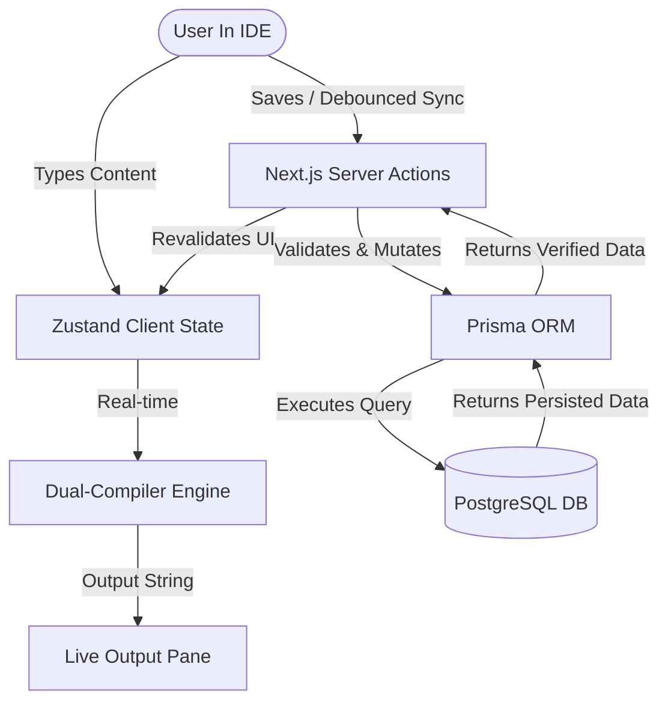

# System Design Architecture

## High-Level Topology

The Agentic Prompt Builder is built as a **BFF (Backend-for-Frontend) Monolith** leveraging the capabilities of **Next.js 15+ (App Router)**.

### 1. Docker-First Infrastructure

The application operates exclusively within a Docker ecosystem to guarantee absolute consistency and zero-trust security (Privacy-First NFRs).

- `app` container: Runs the Next.js runtime environment (Node.js).
- `db` container: A native PostgreSQL 16 container persistantly bound to a local Docker volume.

### 2. The Next.js BFF Layer

Next.js acts as both the client-serving frontend and the secure backend API layer.

- **Frontend (React Server Components & Client Components):** The UI is composed using shadcn/ui and Tailwind CSS. The Split-Pane IDE is highly interactive and relies heavily on React 19 Client Components (`"use client"`).
- **Backend (Next.js Server Actions):** Interaction with the database happens securely on the server via Server Actions over Prisma. No traditional REST `/api/` endpoints are explicitly defined unless strictly needed for third-party integrations (Phase 3).

### 3. State & Compilation

- **Volatile State:** Handled by **Zustand** entirely on the client. UI changes (typing text, reordering blocks) mutate this state in real-time.
- **Compiler Engine:** A decoupled TypeScript utility that synchronously transforms the volatile Zustand state into the final Markdown/XML output in zero-latency.

## Data Flow Diagram

